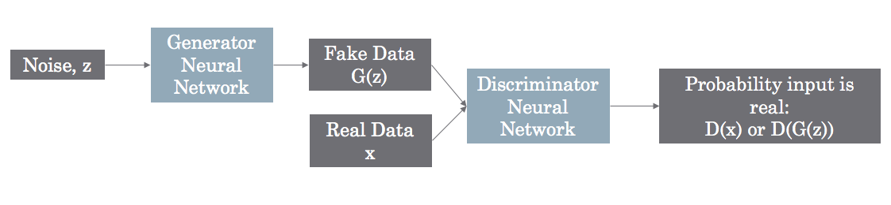

### Intro to GANs

GANs are composed of two deep neural networks. The first network is called the generator, and it’s basically responsible for creating new instances of data from random noise. The second network is called discriminator, and it "judges" if the data generated by the generator is real or fake by comparing it to real data.

### build a generator and discriminator
