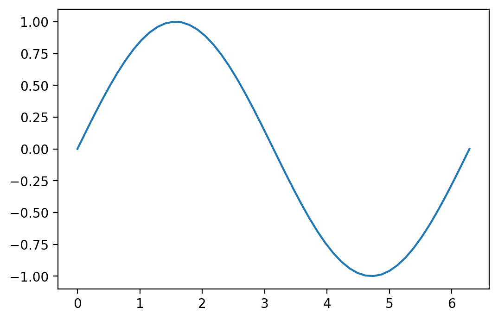

# Mastering Numpy

This is an example of a sine curve created using `numpy` and `matplotlib`.


```python
import numpy as np
import matplotlib.pyplot as plt

x = np.linspace(0, 2*np.pi)
plt.plot(x, np.sin(x))
```

```
[<matplotlib.lines.Line2D at 0x11b18e4e0>]
```

\


## Visual Guide to Numpy


This [article](https://jalammar.github.io/visual-numpy/) about numpy is an excellent resource but build an intuition for numpy arrays if you are a visual thinker.

### Creating Arrays


```python
a = np.array([1,2,3])
print(a)
```

```
[1 2 3]
```


Initialize a certain number of elements in our array using initialization methods:


```python
# ones
print(np.ones(3))
# zeros
print(np.zeros(3))
# random
print(np.random.random(3))
```

```
[1. 1. 1.]
[0. 0. 0.]
[0.06557132 0.42825446 0.13978687]
```


### Array Arithmetic


```python
data = np.array([1,2])
ones = np.ones(2)

# lets add them
# Look ma no loops!
_sum = data + ones
print(_sum)

print(data*ones)
print(data/ones)
```

```
[2. 3.]
[1. 2.]
[1. 2.]
```


### Scalar-Vector operations
operation between an array and a single number (we can also call this an operation between a vector and a scalar)


```python
_ = data * 1.6
print(_)
```

```
[1.6 3.2]
```


### Aggregation


```python
_ = data.max()
print(_)

_ = data.min()
print(_)

_ = data.sum()
print(_)
```

```
2
1
3
```


## More Dimensions

### Creating Matrices


```python
_ = np.array([[1,2],[3,4]])
print(_)

_ = np.ones((3,2))
print("ones: \n", _)

_ = np.zeros((3,2))
print("zeros: \n", _)

_ = np.random.random((3,2))
print("random: \n", _)
```

```
[[1 2]
 [3 4]]
ones:
 [[1. 1.]
 [1. 1.]
 [1. 1.]]
zeros:
 [[0. 0.]
 [0. 0.]
 [0. 0.]]
random:
 [[0.05097071 0.24963939]
 [0.52446999 0.6779733 ]
 [0.83830771 0.00277451]]
```


### Matrix Arithmetic

Requirement: Matrices must be the same size


```python
data = np.array([[1,2],[3,4]])
ones = np.ones((2,2))
_ = data + ones
print(_)
```

```
[[2. 3.]
 [4. 5.]]
```


Broadcast rules in `numpy` allow perfroming arithmetic on matrices of different sizes.


```python
ones_row = np.ones((1,2))
print(ones_row)
print(data)
_ = data + ones_row
print(_)
```

```
[[1. 1.]]
[[1 2]
 [3 4]]
[[2. 3.]
 [4. 5.]]
```


### Dot Product

NumPy gives every matrix a `dot()` method we can use to carry-out dot product operations with other matrices:


```python

data = np.array([1,2,3])
powers_of_ten = np.array([[1,10],[100,1000], [10000, 100000]])

_ = data.dot(powers_of_ten)
print(_)
```

```
[ 30201 302010]
```


```python
import seaborn as sns
sns.set_theme(style="whitegrid")
tips = sns.load_dataset("tips")
ax = sns.stripplot(x=tips["total_bill"])
```

\

### Matrix Indexing


```python
data = np.array([[1,2],[3,4],[5,6]])
print(data.max())
print(data.min())
print(data.sum())
```

```
6
1
21
```


### Aggregation acrosss rows or columns

Not only can we aggregate all the values in a matrix, but we can also aggregate across the rows or columns by using the `axis` parameter:


```python
data = np.array([[1,2],[3,4],[5,6]])
print(data.max(axis=0))
print(data.max(axis=1))
```

```
[5 6]
[2 4 6]
```

