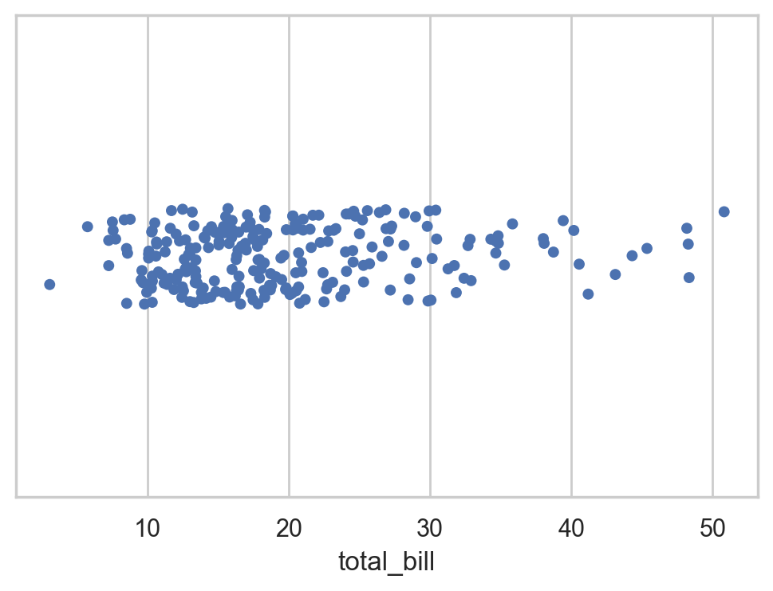

# Mastering Numpy

This is an example of a sine curve created using `numpy` and `matplotlib`.


```python
import numpy as np
import matplotlib.pyplot as plt

x = np.linspace(0, 2*np.pi)
plt.plot(x, np.sin(x))
```

```
[<matplotlib.lines.Line2D at 0x116a14f60>]
```

\


## Visual Guide to Numpy


This [article](https://jalammar.github.io/visual-numpy/) about numpy is an excellent resource but build an intuition for numpy arrays if you are a visual thinker.

### Creating Arrays


```python
a = np.array([1,2,3])
print(a)
```

```
[1 2 3]
```


Initialize a certain number of elements in our array using initialization methods:


```python
# ones
print(np.ones(3))
# zeros
print(np.zeros(3))
# random
print(np.random.random(3))
```

```
[1. 1. 1.]
[0. 0. 0.]
[0.38051625 0.29925985 0.57335242]
```


### Array Arithmetic


```python
data = np.array([1,2])
ones = np.ones(2)

# lets add them
# Look ma no loops!
_sum = data + ones
print(_sum)

print(data*ones)
print(data/ones)
```

```
[2. 3.]
[1. 2.]
[1. 2.]
```


### Scalar-Vector operations
operation between an array and a single number (we can also call this an operation between a vector and a scalar)


```python
_ = data * 1.6
print(_)
```

```
[1.6 3.2]
```


### Aggregation


```python
_ = data.max()
print(_)

_ = data.min()
print(_)

_ = data.sum()
print(_)
```

```
2
1
3
```


## More Dimensions

### Creating Matrices


```python
_ = np.array([[1,2],[3,4]])
print(_)

_ = np.ones((3,2))
print("ones: \n", _)

_ = np.zeros((3,2))
print("zeros: \n", _)

_ = np.random.random((3,2))
print("random: \n", _)
```

```
[[1 2]
 [3 4]]
ones:
 [[1. 1.]
 [1. 1.]
 [1. 1.]]
zeros:
 [[0. 0.]
 [0. 0.]
 [0. 0.]]
random:
 [[0.63369487 0.51086045]
 [0.07164688 0.14436762]
 [0.43776552 0.10002913]]
```


### Matrix Arithmetic

Requirement: Matrices must be the same size


```python
data = np.array([[1,2],[3,4]])
ones = np.ones((2,2))
_ = data + ones
print(_)
```

```
[[2. 3.]
 [4. 5.]]
```


Broadcast rules in `numpy` allow perfroming arithmetic on matrices of different sizes.


```python
ones_row = np.ones((1,2))
print(ones_row)
print(data)
_ = data + ones_row
print(_)
```

```
[[1. 1.]]
[[1 2]
 [3 4]]
[[2. 3.]
 [4. 5.]]
```


### Dot Product

NumPy gives every matrix a `dot()` method we can use to carry-out dot product operations with other matrices:


```python

data = np.array([1,2,3])
powers_of_ten = np.array([[1,10],[100,1000], [10000, 100000]])

_ = data.dot(powers_of_ten)
print(_)
```

```
[ 30201 302010]
```


```python
import seaborn as sns
sns.set_theme(style="whitegrid")
tips = sns.load_dataset("tips")
ax = sns.stripplot(x=tips["total_bill"])
```

\

### Matrix Indexing


```python
data = np.array([[1,2],[3,4],[5,6]])
print(data.max())
print(data.min())
print(data.sum())
```

```
6
1
21
```


### Aggregation acrosss rows or columns

Not only can we aggregate all the values in a matrix, but we can also aggregate across the rows or columns by using the `axis` parameter:


```python
data = np.array([[1,2],[3,4],[5,6]])
print(data.max(axis=0))
print(data.max(axis=1))
```

```
[5 6]
[2 4 6]
```


### Transposing and Reshaping


```python
print("Data:")
print(data)

print("Transpose:")
print(data.T)
```

```
Data:
[[1 2]
 [3 4]
 [5 6]]
Transpose:
[[1 3 5]
 [2 4 6]]
```


### Reshaping


```python
print(data)
_ = data.reshape(2,3)
print(_)
_ = data.reshape(3,2)
print(_)
```

```
[[1 2]
 [3 4]
 [5 6]]
[[1 2 3]
 [4 5 6]]
[[1 2]
 [3 4]
 [5 6]]
```


### Adding ndimensions


```python
_ = np.array([
    [[1,2],[3,4]],
    [[5,6],[7,8]]
])
print(_)

_ = np.ones((4,3,2)) # 4 x 3 x 2 matrix
print(_)

_ = np.zeros((4,3,2)) # 4 x 3 x 2 matrix
print(_)

_ = np.random.random((4,3,2)) # 4 x 3 x 2 matrix
print(_)
```

```
[[[1 2]
  [3 4]]

 [[5 6]
  [7 8]]]
[[[1. 1.]
  [1. 1.]
  [1. 1.]]

 [[1. 1.]
  [1. 1.]
  [1. 1.]]

 [[1. 1.]
  [1. 1.]
  [1. 1.]]

 [[1. 1.]
  [1. 1.]
  [1. 1.]]]
[[[0. 0.]
  [0. 0.]
  [0. 0.]]

 [[0. 0.]
  [0. 0.]
  [0. 0.]]

 [[0. 0.]
  [0. 0.]
  [0. 0.]]

 [[0. 0.]
  [0. 0.]
  [0. 0.]]]
[[[0.48150623 0.8632563 ]
  [0.37164362 0.82039877]
  [0.41370759 0.01785467]]

 [[0.85799963 0.41378305]
  [0.92853418 0.51658944]
  [0.00544379 0.34596991]]

 [[0.06155756 0.3533665 ]
  [0.01587495 0.38448802]
  [0.54410944 0.04685521]]

 [[0.35177808 0.81494685]
  [0.13615483 0.89001441]
  [0.70224719 0.96143105]]]
```


## Practical Usage

### key use 

Mathematical formulas that work on matrices and vectors.

For example: Mean Square Error 


```python
n = 3
predictions = np.ones(n)
labels = np.array([1,2,3])
error = (1/n * np.sum(np.square(predictions - labels))
print(error)
```

```
  File "<ipython-input-1-2bcf442807ad>", line 5
    print(error)
        ^
SyntaxError: invalid syntax
```


Which results in the error value for that prediction and a score for the quality of the model.

### Data Representation

Think of all the data types you’ll need to crunch and build models around (spreadsheets, images, audio…etc). So many of them are perfectly suited for representation in an n-dimensional array:

**Tables and Spreadsheets**

A spreadsheet or a table of values is a two dimensional matrix. Each sheet in a spreadsheet can be its own variable. The most popular abstraction in python for those is the pandas dataframe, which actually uses NumPy and builds on top of it.

**Audio and Timeseries**

An audio file is a one-dimensional array of samples. Each sample is a number representing a tiny chunk of the audio signal. CD-quality audio may have 44,100 samples per second and each sample is an integer between -32767 and 32768. Meaning if you have a ten-seconds WAVE file of CD-quality, you can load it in a NumPy array with length 10 * 44,100 = 441,000 samples. Want to extract the first second of audio? simply load the file into a NumPy array that we’ll call audio, and get audio[:44100].

Here’s a look at a slice of an audio file:

The same goes for time-series data (for example, the price of a stock over time).

**Images**

An image is a matrix of pixels of size (height x width).

If the image is black and white (a.k.a. grayscale), each pixel can be represented by a single number (commonly between 0 (black) and 255 (white)). Want to crop the top left 10 x 10 pixel part of the image? Just tell NumPy to get you image[:10,:10].
Here’s a look at a slice of an image file:

